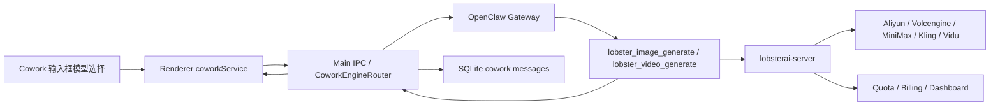

# LobsterAI 生图生视频托管工具设计文档

## 1. 概述

### 1.1 背景

LobsterAI 需要为订阅用户提供内置的图片生成、视频生成功能：

- 订阅用户按套餐获得固定次数的图片生成额度、固定时长的视频生成额度
- 加油包用户仅补充对话额度，不提供图片生成、视频生成权益
- 模型供应商、模型参数、计费策略、异步任务、数据看板均由 `lobsterai-server` 统一承载
- LobsterAI 客户端需要在对话输入框下方提供类似 Lovart 的模型选择能力，允许用户明确选择 Image / Video / Auto 以及具体生成模型
- 该能力不能破坏用户已有的生成图片、生成视频 skill

OpenClaw 已经提供原生 `image_generate` 和 `video_generate` 工具，包含成熟的参数语义、异步任务、媒体结果回传、模型能力描述等契约。但 LobsterAI 的产品需求更强调登录用户、订阅权益、积分扣减、后台看板和服务端统一供应商路由。

因此本设计采用：

**新建 LobsterAI 托管工具，但复用 OpenClaw 原生 media generation 语义。**

即客户端新增 `lobster_image_generate` / `lobster_video_generate` 两个 LobsterAI 管理的内置工具，工具名称明确表达它们走 `lobsterai-server`，但参数、action、返回结构和运行语义尽量与 OpenClaw 原生 `image_generate` / `video_generate` 对齐。

### 1.2 核心定义

“新建 LobsterAI 托管 tool，但复用 OpenClaw 原生语义”指：

- **tool 名称归 LobsterAI**：使用 `lobster_image_generate` / `lobster_video_generate`，明确走 LobsterAI 登录态和计费系统
- **参数语义复用 OpenClaw**：沿用 `prompt`、`images`、`videos`、`durationSeconds`、`resolution`、`aspectRatio`、`action=list|generate|status` 等字段
- **模型路由归 server**：客户端不直接接阿里百炼、火山、MiniMax、Kling、Vidu 等供应商
- **异步和计费归 server**：额度冻结、扣费、失败退款、任务状态、资产存储、数据看板均由 `lobsterai-server` 负责
- **UI 选择决定工具暴露**：用户在输入框明确选择 Image / Video / 模型后，当前 turn 只暴露或强约束对应 LobsterAI tool，避免模型在 OpenClaw 原生工具和 LobsterAI 工具之间摇摆
- **保持未来迁移空间**：如果后续决定把 `lobsterai-server` 注册为 OpenClaw 原生 media provider，由于 schema 和语义已经对齐，迁移成本较低

### 1.3 目标

1. 在 LobsterAI 客户端内置 `lobster_image_generate` / `lobster_video_generate` 工具
2. 工具调用统一带上当前用户的 access token 请求 `lobsterai-server`
3. 对话框下方提供 Image / Video / Auto 的模型选择 UI
4. 用户选择生成模型后，agent 当前 turn 使用对应 LobsterAI 托管工具
5. 服务端统一负责模型供应商、参数策略、异步任务、计费、配额、看板数据
6. 生图、生视频仅作为订阅会员权益开放，不支持加油包抵扣
7. 不影响现有 OpenClaw 原生工具和用户已有 skill

### 1.4 非目标

- 客户端不直接实现各供应商 API 适配
- 客户端不维护模型价格表和供应商策略
- 客户端不在本地完成最终计费决策
- 第一阶段不支持非订阅用户通过加油包购买媒体生成额度
- 第一阶段不要求替换 OpenClaw 原生 `image_generate` / `video_generate`

## 2. 用户场景

### 场景 1: 选择图片模型生成图片

**Given** 用户打开 Cowork 对话输入框  
**When** 用户点击模型选择器，选择 Image tab 下的某个图片模型，并输入“生成一张海边龙虾吉祥物海报”  
**Then** 当前 turn 中 agent 调用 `lobster_image_generate`，工具带 access token 调用 `lobsterai-server`，server 完成生成、扣费并返回图片资产，客户端在会话中展示生成结果

### 场景 2: 选择视频模型生成视频

**Given** 用户在模型选择器中选择 Video tab 下的 `doubao-seedance-2-0-260128`  
**When** 用户输入“生成一个 5 秒的龙虾冲浪短片，16:9，1080P”  
**Then** 当前 turn 中 agent 调用 `lobster_video_generate`，server 创建视频异步任务并冻结预计额度，任务完成后客户端将视频结果回填到原会话

### 场景 3: Auto 模式

**Given** 用户启用模型选择器中的 Auto  
**When** 用户输入“把这张图变成一个 10 秒的视频”并附带图片  
**Then** 客户端根据输入和服务端默认策略选择合适的 LobsterAI 视频模型，agent 当前 turn 使用 `lobster_video_generate`

### 场景 4: 普通聊天不触发媒体扣费

**Given** 用户未选择 Image / Video 模型，当前是普通聊天模型  
**When** 用户发送常规编程问题  
**Then** 当前 turn 不主动暴露 LobsterAI media tool，避免误触发生成和扣费

### 场景 5: 额度不足

**Given** 用户剩余额度不足以提交视频任务  
**When** agent 调用 `lobster_video_generate`  
**Then** server 返回额度不足错误，tool 将错误转为可读结果，客户端刷新 quota，并提示用户升级套餐、联系商务或等待额度重置

### 场景 5a: 非订阅加油包用户尝试生成媒体

**Given** 用户购买了加油包但当前没有有效订阅  
**When** 用户选择 Image / Video 模型并发送生成请求  
**Then** server 拒绝创建任务，客户端提示“媒体生成是订阅会员专属权益”，并引导订阅会员套餐

### 场景 5b: 最高级套餐额度用完

**Given** 用户已经是最高级订阅套餐，且本周期图片次数或视频秒数已经用完  
**When** 用户继续提交媒体生成请求  
**Then** server 硬限制任务创建，客户端提示本周期额度已用完，引导等待下个周期重置或联系商务/企业版，不展示加油包补充入口

### 场景 6: 不影响已有 skill

**Given** 用户已有某个 skill 会使用 OpenClaw 原生 `image_generate`  
**When** 用户没有选择 LobsterAI Image / Video 模型，而是通过 skill 明确触发原生生成能力  
**Then** 原有 skill 行为不被破坏；只有选择 LobsterAI 托管模型的 turn 才对工具做 gating

### 场景 7: 使用 @ 快速引用已上传媒体

**Given** 用户在输入框上传了多张图片、视频或音频，附件区显示 `图片1`、`图片2`、`视频1` 等编号  
**When** 用户在 prompt 中输入 `@` 并选择某个附件，例如“参考@视频1 中的动作，生成@图片2 和@图片3 中的角色打斗的视频”  
**Then** 输入框插入可视化引用 token，发送时客户端将这些引用解析为结构化 media references，并传给 `lobster_video_generate`

## 3. 功能需求

### FR-1: LobsterAI 图片生成工具

新增内置工具 `lobster_image_generate`。

工具支持：

- 文生图
- 图生图
- 多图参考，具体上限由 server 模型能力决定
- 模型列表查询
- 任务状态查询，兼容异步图片模型
- 统一返回资产、计费和任务详情

参数尽量兼容 OpenClaw `image_generate`：

```ts
type LobsterImageGenerateInput = {
  action?: 'generate' | 'list' | 'status';
  prompt?: string;
  model?: string;
  image?: string;
  images?: string[];
  size?: string;
  aspectRatio?: string;
  resolution?: '1K' | '2K' | '4K' | string;
  count?: number;
  filename?: string;
  taskId?: string;
  providerOptions?: Record<string, unknown>;
};
```

### FR-2: LobsterAI 视频生成工具

新增内置工具 `lobster_video_generate`。

工具支持：

- 文生视频
- 图生视频
- 多参考图生视频
- 视频编辑和视频参考生成
- 任务状态查询
- 任务取消
- 统一返回资产、计费和任务详情

参数尽量兼容 OpenClaw `video_generate`：

```ts
type LobsterVideoGenerateInput = {
  action?: 'generate' | 'list' | 'status' | 'cancel';
  prompt?: string;
  model?: string;
  image?: string;
  images?: string[];
  imageRoles?: string[];
  video?: string;
  videos?: string[];
  videoRoles?: string[];
  aspectRatio?: string;
  resolution?: '480P' | '720P' | '768P' | '1080P' | string;
  durationSeconds?: number;
  audio?: boolean;
  watermark?: boolean;
  filename?: string;
  taskId?: string;
  providerOptions?: Record<string, unknown>;
};
```

### FR-3: 服务端模型列表

`lobsterai-server` 返回图片、视频模型列表和能力元数据。

模型元数据至少包含：

- `modelId`
- `modelName`
- `type`: `image` 或 `video`
- `description`
- `capabilities`
- `defaultOptions`
- `pricingHint`
- `quotaHint`
- `enabled`
- `premium`
- `sortOrder`

客户端不硬编码供应商价格，只展示 server 返回的轻量说明。

### FR-4: 输入框模型选择 UI

在 Cowork 输入框下方新增模型选择器，参考 Lovart：

- 支持 `Auto` 开关
- 支持 `Image` / `Video` tab
- 预留 `3D` tab 扩展位，但第一阶段可隐藏或 disabled
- 每个模型展示名称、描述、标签和额度提示
- 用户选择结果持久化为默认偏好
- 选择状态随当前输入框发送到 main process

### FR-5: Turn 级工具 gating

当前 turn 根据用户选择决定工具暴露：

| 用户选择 | 工具策略 |
|---------|----------|
| Image 模型 | 开放 `lobster_image_generate`，隐藏或 deny 原生 `image_generate` |
| Video 模型 | 开放 `lobster_video_generate`，隐藏或 deny 原生 `video_generate` |
| Auto | 根据输入/附件/server 默认策略开放对应 LobsterAI tool |
| 普通聊天 | 不主动暴露 LobsterAI media tool |

工具 gating 必须尽量在工具层或 OpenClaw 配置层完成，不能只依赖 prompt 文案。

### FR-6: 鉴权

工具执行时必须使用当前登录用户的 access token：

- 优先复用现有 `auth_tokens` SQLite 存储
- 遇到 401 时复用现有 refreshToken 刷新逻辑
- token 不写入 tool result、日志、会话消息或 agent prompt
- 所有请求带 `Authorization: Bearer <accessToken>`

### FR-7: 会员权益、计费和配额刷新

图片生成、视频生成功能仅对有效订阅会员开放：

- 免费用户不可用
- 未订阅但购买加油包的用户不可用
- 订阅会员按套餐获得图片生成次数和视频生成秒数
- 加油包额度不参与媒体生成抵扣
- 最高级套餐额度用完后也继续硬限制，不允许用加油包补充
- 如需更高额度，引导联系商务、企业版或等待下个订阅周期

额度模型采用“订阅周期总额度 + 每日防滥用上限”：

- **订阅周期总额度**：随用户订阅周期重置，例如每月重置
- **每日使用上限**：每天按用户所在时区重置，用于控制成本和防滥用
- 生成任务必须同时满足周期剩余额度和今日剩余额度

图片可用额度：

```text
availableImages = min(
  cycleImageLimit - cycleImageUsed - cycleImageFrozen,
  dailyImageLimit - dailyImageUsed - dailyImageFrozen
)
```

视频可用额度：

```text
availableVideoSeconds = min(
  cycleVideoSecondsLimit - cycleVideoSecondsUsed - cycleVideoSecondsFrozen,
  dailyVideoSecondsLimit - dailyVideoSecondsUsed - dailyVideoSecondsFrozen
)
```

任务提交时由 server 冻结额度：

- 图片按 `count` 冻结次数
- 视频按请求的 `durationSeconds` 冻结秒数
- 任务成功后正式扣减
- 任务失败或取消后释放冻结额度
- 不允许生成过程中把用户余额扣成负数

额度不足时按原因区分提示：

| 原因 | 客户端提示 |
|------|------------|
| 非订阅用户 | 媒体生成是订阅会员专属权益，请订阅后使用 |
| 今日额度用完 | 今日媒体生成额度已用完，将于明天重置 |
| 本周期额度用完 | 本周期媒体生成额度已用完，将于下个订阅周期重置 |
| 最高级套餐额度用完 | 已达到最高套餐本周期媒体生成上限，如需更高额度请联系商务 |

工具调用成功或失败后，客户端需要刷新用户 quota：

- 任务提交成功后刷新冻结额度或剩余额度
- 任务完成后刷新最终扣费额度
- 任务失败或取消后刷新退款后的额度
- quota 变化通过现有 auth/quota 状态同步到 renderer

### FR-8: 异步视频任务回填

视频生成默认按异步任务处理：

1. tool 提交任务到 server
2. server 返回 `taskId` 和初始状态
3. main process 记录 `taskId -> coworkSessionId -> turnId`
4. 后台轮询或接收 server 推送
5. 任务完成后将媒体结果追加到原会话
6. 必要时唤醒 agent 生成最终说明

第一阶段可以采用轮询；后续可升级为 server push 或 gateway wake。

### FR-9: 媒体附件 @ 引用

在图片生成视频、视频编辑、多参考图生视频等场景中，用户需要快速指定“哪张图是角色”“哪个视频提供动作参考”。输入框必须支持 `@` 快速引用已上传附件。

上传区行为：

- 支持图片、视频、音频附件
- 上传后按媒体类型和上传顺序自动编号：
  - 图片：`图片1`、`图片2`、`图片3`
  - 视频：`视频1`、`视频2`
  - 音频：`音频1`、`音频2`
- 附件卡片显示缩略图和编号，缩略图底部叠加深色编号 label
- 添加附件入口显示虚线框和 `+ 图片/视频/音频`

输入区行为：

- 用户输入 `@` 时弹出附件引用菜单
- 菜单展示当前已上传附件，包含缩略图、编号和文件名
- 选择后在输入框插入可视化 token，例如 `@图片1`
- token 使用 pill 样式，包含小缩略图和蓝色引用文本
- token 可删除，删除后不影响原始附件
- 支持在自然语言中混排多个引用

发送时客户端必须保留两份信息：

1. 给 agent 阅读的自然语言文本，保留 `@图片1`、`@视频1` 等可读标记
2. 给工具执行的结构化引用映射，包含 token 到本地文件路径或上传后 URL 的映射

结构化引用类型：

```ts
type MediaAttachmentRef = {
  token: string; // '@图片1'
  mediaType: 'image' | 'video' | 'audio';
  index: number;
  fileId: string;
  fileName: string;
  mimeType: string;
  localPath?: string;
  remoteUrl?: string;
  role?: 'first_frame' | 'last_frame' | 'reference_image' | 'reference_video' | 'reference_audio';
};
```

示例 prompt：

```text
参考@视频1 中的动作，生成@图片2 和@图片3 中的角色打斗的视频。
```

发送 metadata：

```json
{
  "content": "参考@视频1 中的动作，生成@图片2 和@图片3 中的角色打斗的视频。",
  "mediaReferences": [
    {
      "token": "@视频1",
      "mediaType": "video",
      "index": 1,
      "fileId": "file_video_1",
      "fileName": "action.mp4",
      "mimeType": "video/mp4",
      "localPath": "/path/to/action.mp4",
      "role": "reference_video"
    },
    {
      "token": "@图片2",
      "mediaType": "image",
      "index": 2,
      "fileId": "file_image_2",
      "fileName": "character-a.png",
      "mimeType": "image/png",
      "localPath": "/path/to/character-a.png",
      "role": "reference_image"
    },
    {
      "token": "@图片3",
      "mediaType": "image",
      "index": 3,
      "fileId": "file_image_3",
      "fileName": "character-b.png",
      "mimeType": "image/png",
      "localPath": "/path/to/character-b.png",
      "role": "reference_image"
    }
  ]
}
```

工具参数映射：

```ts
lobster_video_generate({
  prompt: '参考@视频1 中的动作，生成@图片2 和@图片3 中的角色打斗的视频。',
  videos: ['/path/to/action.mp4'],
  videoRoles: ['reference_video'],
  images: ['/path/to/character-a.png', '/path/to/character-b.png'],
  imageRoles: ['reference_image', 'reference_image']
});
```

如果用户上传了附件但没有在 prompt 中 `@` 引用：

- Image / Video 明确模式下，可按上传顺序自动作为参考输入
- Auto 模式下，优先使用显式 `@` 引用；无显式引用时由客户端或 server 根据附件类型推断
- 自动推断必须在发送前显示或在 tool result details 中记录，避免用户不清楚哪些附件被使用

## 4. 实现方案

### 4.1 总体架构



职责划分：

| 层 | 职责 |
|----|------|
| Renderer | 模型选择 UI、选择状态持久化、发送 turn metadata、展示结果 |
| Main | token 获取和刷新、OpenClaw config/tool gating、任务映射、quota 刷新 |
| OpenClaw tool | 暴露 agent 可调用工具，转换参数，调用 server |
| lobsterai-server | 模型路由、供应商调用、异步任务、计费、额度、资产存储、看板 |

### 4.2 OpenClaw 插件形态

新增本地 OpenClaw extension：

```text
openclaw-extensions/lobster-media-generation/
├── index.ts
├── openclaw.plugin.json
└── package.json
```

插件注册两个 tool：

- `lobster_image_generate`
- `lobster_video_generate`

插件 config 由 `openclawConfigSync.ts` 注入：

```ts
{
  enabled: true,
  config: {
    callbackUrl: 'http://127.0.0.1:<port>/media-generation/tool',
    secret: '${LOBSTER_MCP_BRIDGE_SECRET}',
    requestTimeoutMs: 120000
  }
}
```

设计上尽量复用现有 `mcp-bridge` / `ask-user-question` 模式：

- OpenClaw 插件只负责注册工具和把参数 POST 回 LobsterAI main process
- 真正的 token 处理和 server 调用放在 main process
- 避免 access token 进入 OpenClaw 配置文件

### 4.3 Main process 回调服务

复用现有 MCP Bridge HTTP callback server，新增 media generation 路由：

```http
POST /media-generation/tool
Headers:
  x-lobster-media-secret: <secret>

Body:
{
  "tool": "lobster_video_generate",
  "args": {},
  "context": {
    "sessionKey": "...",
    "toolCallId": "..."
  }
}
```

main process handler：

1. 校验 secret
2. 读取当前 auth tokens
3. 如果 accessToken 过期或 server 返回 401，刷新 token
4. 将 tool args 转为 server API 请求
5. 处理 server 响应
6. 返回 OpenClaw tool result payload

### 4.4 Server API 契约

建议 server 提供如下接口。

#### 获取模型列表

```http
GET /api/media/models?type=image|video
Authorization: Bearer <accessToken>
```

响应：

```json
{
  "code": 0,
  "data": [
    {
      "modelId": "qwen-image-2.0-pro",
      "modelName": "Qwen Image 2.0 Pro",
      "type": "image",
      "description": "High quality text-to-image and image-to-image model.",
      "capabilities": {
        "textToImage": true,
        "imageToImage": true,
        "maxInputImages": 4,
        "supportedAspectRatios": ["1:1", "16:9", "9:16"],
        "supportedResolutions": ["1K", "2K"]
      },
      "premium": false,
      "enabled": true,
      "sortOrder": 10
    }
  ]
}
```

#### 获取媒体权益和额度

```http
GET /api/media/entitlement
Authorization: Bearer <accessToken>
```

响应：

```json
{
  "code": 0,
  "data": {
    "subscriptionStatus": "active",
    "planId": "pro",
    "planName": "Pro",
    "isMediaGenerationEnabled": true,
    "cycle": {
      "resetAt": "2026-06-01T00:00:00+08:00",
      "imageLimit": 300,
      "imageUsed": 42,
      "imageFrozen": 2,
      "videoSecondsLimit": 600,
      "videoSecondsUsed": 120,
      "videoSecondsFrozen": 10
    },
    "daily": {
      "resetAt": "2026-05-14T00:00:00+08:00",
      "imageLimit": 50,
      "imageUsed": 12,
      "imageFrozen": 2,
      "videoSecondsLimit": 120,
      "videoSecondsUsed": 30,
      "videoSecondsFrozen": 10
    }
  }
}
```

#### 提交生成任务

```http
POST /api/media/generations
Authorization: Bearer <accessToken>
Content-Type: application/json
```

请求：

```json
{
  "type": "video",
  "model": "doubao-seedance-2-0-260128",
  "prompt": "Generate a 5 second lobster surfing video.",
  "inputs": {
    "images": [],
    "videos": []
  },
  "options": {
    "durationSeconds": 5,
    "resolution": "1080P",
    "aspectRatio": "16:9",
    "audio": true
  },
  "idempotencyKey": "session_turn_prompt_hash",
  "clientContext": {
    "app": "lobsterai-desktop",
    "coworkSessionId": "session_xxx",
    "openclawSessionKey": "agent:main:lobsterai:xxx"
  }
}
```

响应：

```json
{
  "code": 0,
  "data": {
    "taskId": "media_task_xxx",
    "status": "queued",
    "model": "doubao-seedance-2-0-260128",
    "billing": {
      "estimatedVideoSeconds": 5,
      "frozenVideoSeconds": 5
    }
  }
}
```

#### 查询任务状态

```http
GET /api/media/generations/:taskId
Authorization: Bearer <accessToken>
```

完成响应：

```json
{
  "code": 0,
  "data": {
    "taskId": "media_task_xxx",
    "status": "succeeded",
    "model": "doubao-seedance-2-0-260128",
    "assets": [
      {
        "type": "video",
        "url": "https://assets.example.com/result.mp4",
        "mimeType": "video/mp4",
        "filename": "result.mp4",
        "durationSeconds": 5
      }
    ],
    "billing": {
      "chargedVideoSeconds": 5,
      "refundedVideoSeconds": 0
    }
  }
}
```

#### 取消任务

```http
POST /api/media/generations/:taskId/cancel
Authorization: Bearer <accessToken>
```

### 4.5 Tool result 契约

OpenClaw tool result 使用结构化 text + details：

```ts
type LobsterMediaToolResult = {
  content: Array<{ type: 'text'; text: string }>;
  isError?: boolean;
  details: {
    taskId?: string;
    status: 'queued' | 'running' | 'succeeded' | 'failed' | 'cancelled';
    model?: string;
    assets?: Array<{
      type: 'image' | 'video';
      url?: string;
      filePath?: string;
      mimeType?: string;
      filename?: string;
    }>;
    billing?: {
      frozenImages?: number;
      chargedImages?: number;
      refundedImages?: number;
      frozenVideoSeconds?: number;
      chargedVideoSeconds?: number;
      refundedVideoSeconds?: number;
    };
    normalization?: Record<string, unknown>;
    warnings?: string[];
  };
};
```

用户可见文本示例：

```text
Video generation task created.
Task ID: media_task_xxx
Status: queued
Frozen video seconds: 5
```

完成后：

```text
Video generation completed.
Model: doubao-seedance-2-0-260128
Output: result.mp4
Charged video seconds: 5
```

### 4.6 媒体资产处理

server 返回远程 URL 后，客户端有两种选择：

1. 直接展示远程 URL 媒体
2. 下载到 OpenClaw/LobsterAI media 目录，再以本地 file path 形式展示

第一阶段建议：

- 图片：优先下载到本地 media 目录，方便 artifact/markdown 图片预览和离线历史查看
- 视频：可先保留远程 URL + 本地缓存下载，避免大文件阻塞 tool 返回

本地缓存目录建议放在 OpenClaw state media 或 LobsterAI userData media 子目录，避免写入工作区污染项目文件。

### 4.7 输入框模型选择状态

新增 turn metadata：

```ts
type MediaGenerationSelection = {
  mode: 'auto' | 'image' | 'video' | 'none';
  modelId?: string;
  modelName?: string;
  source: 'lobsterai-server';
  mediaReferences?: MediaAttachmentRef[];
};
```

发送 cowork session / continue session 时附带：

```ts
{
  mediaGenerationSelection: {
    mode: 'video',
    modelId: 'doubao-seedance-2-0-260128',
    source: 'lobsterai-server'
  }
}
```

main process 将该 metadata 用于：

- OpenClaw tool gating
- server 请求 clientContext
- idempotencyKey 生成
- 将 `@图片1` / `@视频1` 引用解析为 `images` / `videos` / role arrays
- 会话历史记录和 UI 回显

### 4.8 Tool gating 实现策略

优先级从高到低：

1. **Turn 级 tools allow/deny**：如果 OpenClaw 当前 chat.send 支持 `toolsAllow` 或类似机制，直接在 turn 上只开放对应工具
2. **Session 级 prompt + plugin factory**：OpenClaw 插件根据 session context 判断当前是否返回 tool
3. **Config deny fallback**：通过 `openclawConfigSync` 在必要时 deny 原生 `image_generate` / `video_generate`

推荐第一阶段实现：

- `lobster_image_generate` / `lobster_video_generate` 作为插件常驻注册
- 插件 tool execute 阶段检查 main process 当前 turn media selection
- 如果当前 turn 未选择对应 mode，返回 `isError=true` 且提示工具不可用于当前 turn
- 同时在 prompt 中明确：“当用户选择 LobsterAI Image/Video 模型时，必须使用 lobster_* 工具”

后续优化为真正的 turn 级工具可见性控制。

### 4.9 与现有 skill 的兼容

兼容原则：

- 不全局禁用 OpenClaw 原生 `image_generate` / `video_generate`
- 只在用户明确选择 LobsterAI Image / Video 模型的 turn 中限制原生工具
- 现有 skill 如果显式依赖原生工具，在普通聊天或 skill 自身流程中仍可运行
- LobsterAI 托管工具的 schema 与原生工具相近，skill 后续迁移只需替换工具名或通过 adapter 映射

### 4.10 服务端权益和计费策略建议

计费必须由 server 做最终裁决。

推荐流程：

1. 创建任务前校验用户是否为有效订阅会员
2. 非订阅用户直接拒绝，不允许使用加油包抵扣媒体生成
3. 校验周期总额度和每日额度是否都足够
4. 图片按 `count` 冻结次数，视频按 `durationSeconds` 冻结秒数
5. 任务成功后正式扣减冻结额度
6. 任务失败或取消时释放冻结额度
7. 如果供应商实际产物时长和请求时长存在差异，由 server 按产品策略多退少不补或按最大可用额度提交
8. 不允许生成完成后再让用户媒体额度变负

最高级套餐额度用完时：

- 继续硬限制
- 不提供加油包补充入口
- 引导等待下个订阅周期重置
- 提供联系商务、企业版或定制额度入口

### 4.11 数据看板

`lobsterai-server` 在每次任务生命周期变化时记录：

- 用户 ID
- 订阅计划
- 模型 ID
- 供应商
- 任务类型
- 输入模式：text-to-image、image-to-image、text-to-video、image-to-video、video-edit
- 参数：时长、分辨率、数量、参考图数量
- 状态：queued、running、succeeded、failed、cancelled
- 周期额度、每日额度、冻结额度、实际扣减额度、释放额度
- 供应商成本
- 错误码和失败原因

admin 后台基于这些数据做流量、成本、收入和失败率看板。

## 5. 边界情况

| 场景 | 处理方式 |
|------|---------|
| 用户未登录 | tool 返回需要登录的错误，UI 引导登录 |
| 免费用户或非订阅用户 | 拒绝媒体生成，引导订阅会员 |
| 仅购买加油包的用户 | 拒绝媒体生成，说明加油包仅用于对话额度 |
| accessToken 过期 | main process 刷新 token 后重试一次 |
| refreshToken 过期 | 清除本地 token，提示重新登录 |
| 今日额度不足 | server 拒绝创建任务，提示明日重置时间 |
| 本周期额度不足 | server 拒绝创建任务，提示订阅周期重置时间 |
| 最高级套餐本周期额度不足 | 硬限制，引导联系商务或等待周期重置，不展示加油包入口 |
| 视频生成过程中余额变化 | server 使用预冻结额度，不由客户端判断余额 |
| 任务失败 | server 释放冻结额度，tool/status 返回失败原因 |
| 用户重复点击发送或 agent 重试 | 使用 idempotencyKey，server 返回同一任务，避免重复扣费 |
| 同一 session 已有视频任务运行 | 客户端或 server 返回现有 task 状态，避免并发重复生成 |
| 模型下架 | 模型列表不再返回；已选模型发送前重新校验，失效则提示重新选择 |
| server 返回参数不支持 | server 统一做参数归一化或拒绝，并在 details.normalization / warnings 中说明 |
| 图片/视频 URL 下载失败 | 保留远程 URL 展示，记录 warn，不阻塞任务完成 |
| 用户关闭应用后任务完成 | 下次启动通过 task 状态同步恢复并回填会话，或在任务中心展示 |
| IM 场景触发媒体生成 | 第一阶段只支持桌面 Cowork；IM 支持需单独设计鉴权和投递策略 |
| 原生 OpenClaw tool 同时存在 | 只在 LobsterAI 模型选择 turn 做 gating，不全局禁用 |
| 用户输入不存在的引用，如 `@图片9` | 发送前提示引用不存在，阻止发送或要求删除无效 token |
| 用户删除附件但 prompt 中仍有引用 token | 自动删除对应 token，或标红提示失效引用 |
| 同名文件或重复上传 | UI 编号按上传顺序生成，引用绑定 fileId，不依赖文件名 |
| 模型不支持多图或视频参考 | server 返回能力限制错误，客户端提示减少附件或更换模型 |
| 显式引用和自动附件推断冲突 | 显式 `@` 引用优先 |

## 6. 涉及文件

| 文件 | 操作 |
|------|------|
| `openclaw-extensions/lobster-media-generation/openclaw.plugin.json` | 新建，声明 LobsterAI media generation 插件 |
| `openclaw-extensions/lobster-media-generation/index.ts` | 新建，注册 `lobster_image_generate` / `lobster_video_generate` |
| `openclaw-extensions/lobster-media-generation/package.json` | 新建，插件包配置 |
| `src/main/libs/openclawConfigSync.ts` | 修改，启用插件并注入 callback config |
| `src/main/main.ts` | 修改，新增 media generation callback route / IPC / entitlement refresh |
| `src/main/preload.ts` | 修改，暴露模型列表、媒体权益和选择相关 IPC |
| `src/main/coworkStore.ts` | 修改，持久化默认 media model selection 和任务映射 |
| `src/renderer/types/cowork.ts` | 修改，新增 media generation selection 类型 |
| `src/renderer/services/cowork.ts` | 修改，发送 turn metadata |
| `src/renderer/components/cowork/CoworkPromptInput.tsx` | 修改，集成模型选择器入口 |
| `src/renderer/components/cowork/MediaGenerationModelPicker.tsx` | 新建，Lovart 风格模型选择器 |
| `src/renderer/components/cowork/MediaAttachmentReferenceMenu.tsx` | 新建，`@` 附件引用菜单 |
| `src/renderer/components/cowork/MediaReferenceToken.tsx` | 新建，输入框内的附件引用 token |
| `src/renderer/utils/mediaReferenceParser.ts` | 新建，解析 prompt 中的 `@图片1` / `@视频1` 引用 |
| `src/renderer/services/i18n.ts` | 修改，新增中英文 UI 文案 |
| `src/renderer/store/slices/coworkSlice.ts` | 修改，保存选择状态和任务状态 |
| `src/renderer/components/cowork/CoworkSessionDetail.tsx` | 修改，展示媒体任务状态和结果 |

## 7. 实施步骤

### Phase 1: Server contract 和工具骨架

1. 与 `lobsterai-server` 对齐 `/api/media/models`、`/api/media/entitlement`、`/api/media/generations`、status、cancel API
2. 新建 `lobster-media-generation` OpenClaw extension
3. 注册两个工具，schema 对齐 OpenClaw 原生语义
4. main process 增加 callback route，完成 token 鉴权和 server 调用
5. 支持 `action=list` 和图片同步生成最小闭环

### Phase 2: 视频异步任务

1. 实现 `lobster_video_generate action=generate`
2. main process 持久化 task 映射
3. 轮询任务状态
4. 成功后回填视频结果到原会话
5. 失败、取消、额度变化时刷新 quota

### Phase 3: 模型选择 UI

1. 新增 Lovart 风格模型选择器
2. 接入 server 模型列表
3. 支持 Image / Video / Auto
4. 选择结果随 turn metadata 发送
5. 根据 selection 做工具 gating
6. 支持上传附件后的 `@图片1` / `@视频1` / `@音频1` 快速引用和结构化 metadata

### Phase 4: 兼容和观测

1. 验证已有 skill 不受影响
2. 增加日志和错误分类
3. 增加 quota 刷新和任务状态 UI
4. 增加单元测试和手动端到端验证

## 8. 验收标准

1. 输入框模型选择器可以显示 server 返回的图片和视频模型
2. 用户选择图片模型后，当前 turn 调用 `lobster_image_generate`
3. 用户选择视频模型后，当前 turn 调用 `lobster_video_generate`
4. 普通聊天 turn 不主动触发 LobsterAI media tool
5. 工具请求携带 access token，且 token 不出现在日志、消息和 tool result 中
6. 额度不足时生成失败且提示清晰，quota 自动刷新
7. 视频任务创建后显示 queued/running 状态，完成后回填视频结果
8. 任务失败或取消后 server 释放冻结额度，客户端刷新 quota
9. 重复提交同一 turn 不重复扣费
10. 现有依赖 OpenClaw 原生 `image_generate` / `video_generate` 的 skill 不被全局破坏
11. 非订阅加油包用户不能使用图片生成、视频生成
12. 今日额度用完和本周期额度用完的提示不同，且显示对应重置时间
13. 最高级套餐额度用完后不展示加油包补充入口，展示联系商务或等待重置
14. 上传多个媒体文件后，附件区按类型显示 `图片1`、`视频1`、`音频1` 等编号
15. 输入 `@` 可以选择已上传附件，并在输入框插入可视化引用 token
16. prompt 中的 `@图片1` / `@视频1` 能正确解析为 `images` / `videos` / role arrays
17. 删除附件后，对应引用 token 不会被静默发送为无效引用
18. 中英文 UI 文案完整
19. `npm run lint` 通过

## 9. 待确认问题

1. server 是否提供任务完成 webhook，还是第一阶段仅支持客户端轮询
2. 视频生成完成后是直接回填结果，还是唤醒 agent 生成自然语言总结
3. 远程媒体 URL 是否需要强制下载到本地，还是允许历史消息依赖远程资产
4. Auto 模式由客户端规则选择模型，还是完全调用 server 推荐接口
5. 3D tab 是否第一阶段隐藏，还是显示 disabled 占位
6. IM 场景是否纳入第一版，还是只支持桌面 Cowork
7. 最高级套餐联系商务入口跳转到 portal、客服 IM，还是企业版表单
8. 每日额度按用户本地时区、订阅购买时区，还是 server 统一业务时区重置
9. `@` 引用 token 是否需要支持用户手动改名，例如把 `图片1` 改成“主角”
10. 图片角色、动作参考、首帧、尾帧等 role 是由用户显式选择，还是第一阶段通过 prompt 语义和默认规则推断
